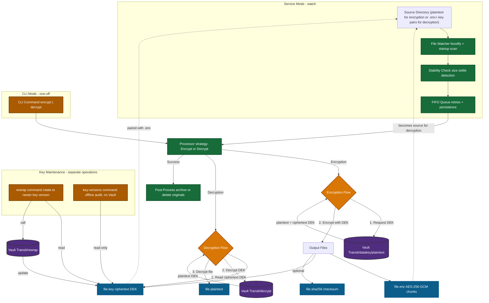

# Vault File Encryption

[](https://github.com/gitrgoliveira/vault-file-encryption/actions)
[](https://goreportcard.com/report/github.com/gitrgoliveira/vault-file-encryption)

This application is an MVP that watches directories for files, encrypts them using HashiCorp Vault Transit Engine with envelope encryption, and stores the encrypted files in a separate folder. Works with both **HCP Vault (cloud)** and **Vault Enterprise (self-hosted)**.

> [!WARNING]
> **v2.0.0 Breaking Changes**: This version introduces a new encrypted file format using the `go-fileencrypt` library. Files encrypted with previous versions are **not compatible**. See [MIGRATION_GUIDE.md](MIGRATION_GUIDE.md) for upgrade instructions.


## High-Level Overview

```
[File Watcher] 
[     or     ] ---> [FIFO Queue] ---> [Processor]
[    CLI     ]                            |
                                          v
                                    [Vault Agent]
                                  (local listener)
                                         |
                                         v
                                  [Vault Transit]
                                   [   Engine    ]
```

### Encryption Flow

1. File appears in source directory
2. Watcher detects and queues file
3. Processor generates data key via Vault
4. File encrypted with AES-256-GCM using data key
5. Data key encrypted with Vault Transit key
6. Encrypted file and key saved to destination
7. Original file archived or deleted

### Workflow Diagram

The diagram below shows both the continuous Service Mode path (through watcher + queue) and the one-off CLI Mode path (direct to processor). The processor handles both encryption and decryption via strategy pattern. Re-wrap and key version audit operations are shown separately as they only work with `.key` files.



Key points:
- Service Mode always passes through the watcher and queue, ensuring ordering, retries, and persistence.
- CLI Mode bypasses watcher/queue for immediate single-file processing.
- `.key` files store only ciphertext DEKs; plaintext keys never hit disk.
- Re-wrap updates `.key` files to newer Vault key versions without touching `.enc` data.
- Key version auditing (`key-versions`) runs offline (no Vault calls).

## Features

- **File System Watching**: Automatic detection of new files with `fsnotify`
- **Envelope Encryption**: Uses Vault Transit Engine for secure key management
- **Bidirectional**: Support for both encryption and decryption modes
- **Progress Logging**: Real-time progress updates every 20%
- **Retry Logic**: FIFO queue with exponential backoff
- **Integrity Verification**: Optional SHA256 checksum validation
- **Hot Reload**: Configuration changes without restart (SIGHUP on Unix)
- **Enhanced Security** (via [`go-fileencrypt`](https://github.com/gitrgoliveira/go-fileencrypt)): 
  - Constant-time memory zeroing (prevents compiler optimization)
  - Memory locking (prevents key swapping to disk)
  - Authenticated encryption with AES-256-GCM
  - Secure, versioned file format with magic headers and salt
  - Chunk size validation (prevents DOS attacks)
- **Cross-Platform**: Binaries for macOS, Windows, Linux (64-bit)
- **Comprehensive Logging**: Plaintext or JSON format with audit support
- **CLI Mode**: One-off encryption/decryption operations
- **Configurable Chunk Size**: Optimize encryption for file size (64KB-10MB)
- **Key Re-wrapping**: Rotate encrypted DEKs to newer Vault key versions without re-encrypting data

## Table of Contents

- [Prerequisites](#prerequisites)
- [Quick Start](#quick-start)
- [Installation](#installation)
- [Configuration](#configuration)
- [Usage](#usage)
- [Architecture](#architecture)
- [Development](#development)
- [Testing](#testing)
- [Contributing](#contributing)
- [License](#license)

## Prerequisites

- **Go 1.25.0+** (for building from source)
- **Vault**: One of the following:
  - **HCP Vault** cluster with Transit Engine enabled, OR
  - **Vault Enterprise** (or Community Edition) for local development
- **Vault Agent** configured with appropriate authentication:
  - **HCP Vault**: Token-based authentication (for testing only)
  - **Vault Enterprise**: Certificate-based authentication

## Quick Start

### 1. Build the Application

```bash
git clone https://github.com/gitrgoliveira/vault-file-encryption.git
cd vault-file-encryption
make build
```

### 2. Set Up Vault

Choose your Vault deployment:

**Option A: HCP Vault (Cloud)**
```bash
# Follow the HCP Vault setup guide
# See: docs/guides/VAULT_SETUP_GUIDE.md
cd scripts/vault-setup
terraform init
terraform apply
```

**Option B: Vault Enterprise (Local Dev Mode)**
```bash
# Follow the Vault Enterprise setup guide
# See: docs/guides/VAULT_ENTERPRISE_SETUP_GUIDE.md
cd scripts/vault-setup-enterprise
./01-start-vault-dev.sh    # Terminal 1
./02-configure-vault.sh    # Terminal 2
```

### 3. Start Vault Agent

**For HCP Vault**:
```bash
# Unix/Linux/macOS
vault agent -config=configs/vault-agent/vault-agent-hcp-token.hcl
```

```powershell
# Windows
vault agent -config=configs\vault-agent\vault-agent-hcp-token.hcl
```

**For Vault Enterprise**:
```bash
# Unix/Linux/macOS
vault agent -config=configs/vault-agent/vault-agent-enterprise-dev.hcl
```

```powershell
# Windows
vault agent -config=configs\vault-agent\vault-agent-enterprise-dev.hcl
```

### 4. Encrypt a File (CLI Mode)

**HCP Vault**:
```bash
# Unix/Linux/macOS
./bin/file-encryptor encrypt \
  -i myfile.txt \
  -o myfile.txt.enc \
  -c configs/examples/example.hcl
```

```powershell
# Windows
.\bin\file-encryptor-windows-amd64.exe encrypt `
  -i myfile.txt `
  -o myfile.txt.enc `
  -c configs\examples\example.hcl
```

**Vault Enterprise**:
```bash
# Unix/Linux/macOS
./bin/file-encryptor encrypt \
  -i myfile.txt \
  -o myfile.txt.enc \
  -c configs/examples/example-enterprise.hcl
```

```powershell
# Windows
.\bin\file-encryptor-windows-amd64.exe encrypt `
  -i myfile.txt `
  -o myfile.txt.enc `
  -c configs\examples\example-enterprise.hcl
```

This creates:
- `myfile.txt.enc` - Encrypted file
- `myfile.txt.key` - Encrypted data key

### 5. Run Service Mode (Watch Directories)

```bash
# Unix/Linux/macOS
./bin/file-encryptor watch -c configs/examples/example.hcl
```

```powershell
# Windows (hot-reload not available - restart to reload config)
.\bin\file-encryptor-windows-amd64.exe watch -c configs\examples\example.hcl
```

The service will:
- Scan and process any pre-existing files in configured directories on startup
- Monitor configured directories for new files (using fsnotify)
- Queue files for processing with retry logic
- Encrypt/decrypt files automatically
- Save queue state on shutdown

---

## Installation

### Download Pre-built Binaries

Download the latest release for your platform from the [Releases](https://github.com/gitrgoliveira/vault-file-encryption/releases) page:

- **Windows (64-bit)**: `file-encryptor-windows-amd64.exe`
- **macOS (64-bit)**: `file-encryptor-darwin-amd64`
- **Linux (64-bit)**: `file-encryptor-linux-amd64`

### Build from Source

**Prerequisites**:
- Go 1.25.0 or later
- Make (Unix/Linux/macOS) or use `go build` directly on Windows

```bash
# Unix/Linux/macOS
git clone https://github.com/gitrgoliveira/vault-file-encryption.git
cd vault-file-encryption
make build

# Build for all platforms
make build-all
```

```powershell
# Windows (using Git Bash or WSL for Make)
git clone https://github.com/gitrgoliveira/vault-file-encryption.git
cd vault-file-encryption
make build-windows

# Or build directly with go
go build -o bin\file-encryptor.exe cmd/file-encryptor/main.go
```

## Configuration

### Example Configuration

See [`configs/examples/example.hcl`](configs/examples/example.hcl) for a complete configuration example.

### Minimal Configuration

```hcl
vault {
  agent_address = "http://127.0.0.1:8200"
  transit_mount = "transit"
  key_name = "file-encryption-key"
}

encryption {
  source_dir = "/data/source"
  dest_dir = "/data/encrypted"
  source_file_behavior = "archive"
  chunk_size = "2MB"  # Optional: 64KB-10MB, default 1MB
}

queue {
  state_path = "/var/lib/file-encryptor/queue-state.json"
}

logging {
  level = "info"
  output = "stdout"
}
```

### Chunk Size Configuration

Control memory usage and performance by configuring the encryption chunk size:

**In Configuration File** (`config.hcl`):
```hcl
encryption {
  # ... other settings ...
  chunk_size = "2MB"  # Options: 64KB-10MB, default 1MB
}
```

**CLI Override**:
```bash
./bin/file-encryptor encrypt -i file.txt -o file.txt.enc --chunk-size 512KB
```

**Supported Formats**:
- Standard: `"64KB"`, `"512KB"`, `"1MB"`, `"2MB"`, `"10MB"`
- Decimal: `"1.5MB"`, `"0.5GB"`
- With spaces: `"1 MB"`, `"512 KB"`
- Case insensitive: `"1mb"`, `"1MB"`, `"1Mb"`
- Plain numbers: `"1024"` (bytes)

**Size Recommendations**:
- Small files (<1MB): `256KB` - Lower memory usage
- Medium files (1-100MB): `512KB-2MB` - Balanced (default: 1MB)
- Large files (100MB-1GB): `2MB-4MB` - Better throughput
- Very large files (>1GB): `4MB-8MB` - Maximum performance

**Note**: Service mode processes one file at a time, so choose chunk size based on your typical file size, not concurrent operations.

See [`docs/guides/CHUNK_SIZE_TUNING.md`](docs/guides/CHUNK_SIZE_TUNING.md) for detailed tuning guide with benchmarking and troubleshooting.

### Hot Reload

The application supports configuration hot-reload without restart on **Unix systems** (Linux, macOS, BSD).

**Unix/Linux/macOS:**
```bash
# Find the process ID
ps aux | grep file-encryptor

# Send SIGHUP signal
kill -HUP <pid>
# or
pkill -SIGHUP file-encryptor
```

**Windows:**
> **Note**: Hot-reload via signals is not supported on Windows due to OS limitations. To reload configuration, you must restart the service/application.
>
> **To reload configuration on Windows**:
> 1. Stop the application (Ctrl+C or Stop-Service)
> 2. Update the configuration file
> 3. Restart the application
>
> **For Production**: Use a Windows Service wrapper like [NSSM](https://nssm.cc/) or [WinSW](https://github.com/winsw/winsw) that can be easily stopped/started via service commands.

## Usage

### Command-Line Interface

```
file-encryptor [command] [flags]

Commands:
  watch         Run as a service watching directories for files
  encrypt       Encrypt a single file
  decrypt       Decrypt a single file
  rewrap        Re-wrap encrypted data keys to newer versions
  key-versions  Display encryption key version statistics
  help          Help about any command

Global Flags:
  -c, --config string      Configuration file path (default "config.hcl")
  -l, --log-level string   Log level (debug, info, error) (default "info")
  -o, --log-output string  Log output (stdout, stderr, or file path) (default "stdout")
  -h, --help              Help for file-encryptor
  -v, --version           Version information
```

### Service Mode Examples

**Start file watcher:**
```bash
./bin/file-encryptor watch -c config.hcl
```

**Start with debug logging:**
```bash
./bin/file-encryptor watch -c config.hcl --log-level debug
```

**Log to file:**
```bash
./bin/file-encryptor watch -c config.hcl --log-output /var/log/file-encryptor.log
```

### CLI Mode Examples

**Encrypt a file:**
```bash
./bin/file-encryptor encrypt -i sensitive.pdf -o sensitive.pdf.enc
```

**Encrypt with custom key file:**
```bash
./bin/file-encryptor encrypt -i data.txt -o data.txt.enc -k my-key.key
```

**Encrypt with checksum:**
```bash
./bin/file-encryptor encrypt -i file.dat -o file.dat.enc --checksum
```

**Decrypt a file:**
```bash
./bin/file-encryptor decrypt -i file.dat.enc -k file.dat.key -o decrypted-file.dat
```

**Decrypt with checksum verification:**
```bash
./bin/file-encryptor decrypt -i file.dat.enc -k file.dat.key -o decrypted-file.dat --verify-checksum
```

**Re-wrap encryption keys to newer version:**
```bash
# Re-wrap all keys in a directory to minimum version 2
./bin/file-encryptor rewrap --dir /path/to/keys --recursive --min-version 2

# Dry-run to preview what would be re-wrapped
./bin/file-encryptor rewrap --dir /path/to/keys --dry-run --min-version 2

# Export results as JSON
./bin/file-encryptor rewrap --dir /path/to/keys --min-version 2 --format json
```

**Display key version statistics:**
```bash
# Show version distribution for all keys in a directory (no config needed)
./bin/file-encryptor key-versions --dir /path/to/keys --recursive

# Output as JSON for analysis
./bin/file-encryptor key-versions --dir /path/to/keys --format json

# Output as CSV for spreadsheets
./bin/file-encryptor key-versions --dir /path/to/keys --format csv
```

**Note**: The `key-versions` command works offline and does not require Vault configuration.

For detailed rewrap documentation, see [REWRAP_GUIDE.md](docs/guides/REWRAP_GUIDE.md).

## Architecture

For detailed architecture documentation, see [ARCHITECTURE.md](docs/ARCHITECTURE.md).

### Vault Policies

The application requires specific Vault Transit Engine capabilities depending on the operation mode. Three separate policies are recommended for least-privilege access:

#### 1. Encryption Policy

Required for encrypting files (generating and encrypting data keys):

```hcl
# Policy name: file-encryptor-encrypt
path "transit/datakey/plaintext/file-encryption-key" {
  capabilities = ["update"]
}
```

**Capabilities:**
- `datakey/plaintext/*` - Generate a new data encryption key (DEK) in both plaintext and ciphertext forms

**Used by:**
- Service mode encryption operations
- CLI `encrypt` command

#### 2. Decryption Policy

Required for decrypting files (decrypting data keys):

```hcl
# Policy name: file-encryptor-decrypt
path "transit/decrypt/file-encryption-key" {
  capabilities = ["update"]
}
```

**Capabilities:**
- `decrypt/*` - Decrypt the ciphertext DEK to obtain the plaintext DEK

**Used by:**
- Service mode decryption operations
- CLI `decrypt` command

#### 3. Re-wrap Policy

Required for key rotation (re-wrapping encrypted DEKs to newer key versions):

```hcl
# Policy name: file-encryptor-rewrap
path "transit/rewrap/file-encryption-key" {
  capabilities = ["update"]
}
```

**Capabilities:**
- `rewrap/*` - Re-encrypt an existing ciphertext DEK with the latest key version without exposing plaintext

**Used by:**
- CLI `rewrap` command

#### Combined Policy (Development/Testing Only)

For development or testing environments, you can use a combined policy with all capabilities:

```hcl
# Policy name: file-encryptor-combined (NOT recommended for production)
path "transit/datakey/plaintext/file-encryption-key" {
  capabilities = ["update"]
}

path "transit/decrypt/file-encryption-key" {
  capabilities = ["update"]
}

path "transit/rewrap/file-encryption-key" {
  capabilities = ["update"]
}
```

**Production Recommendation:**
- Use **separate policies** for each operation type
- Assign policies based on the specific role (encryption-only systems, decryption-only systems, key rotation operators)
- Apply the principle of least privilege

#### Policy Assignment Examples

**HCP Vault (Token Auth):**
```bash
# Create policies
vault policy write file-encryptor-encrypt encrypt-policy.hcl
vault policy write file-encryptor-decrypt decrypt-policy.hcl
vault policy write file-encryptor-rewrap rewrap-policy.hcl

# Generate tokens with specific policies
vault token create -policy=file-encryptor-encrypt -period=24h
vault token create -policy=file-encryptor-decrypt -period=24h
vault token create -policy=file-encryptor-rewrap -period=1h
```

**Vault Enterprise (Certificate Auth):**
```bash
# Map certificate common names to policies
vault write auth/cert/certs/file-encryptor-encrypt \
  certificate=@client-encrypt.crt \
  policies=file-encryptor-encrypt

vault write auth/cert/certs/file-encryptor-decrypt \
  certificate=@client-decrypt.crt \
  policies=file-encryptor-decrypt

vault write auth/cert/certs/file-encryptor-rewrap \
  certificate=@client-rewrap.crt \
  policies=file-encryptor-rewrap
```

**Note:** The `key-versions` command does not require any Vault access as it operates offline on local `.key` files.

For complete Vault setup instructions including policy configuration, see:
- [Vault Setup Guide (HCP)](docs/guides/VAULT_SETUP_GUIDE.md)
- [Vault Enterprise Setup Guide](docs/guides/VAULT_ENTERPRISE_SETUP_GUIDE.md)


## Development

### Requirements

- Go 1.25.0 or later
- Make
- golangci-lint (optional, for linting)

### Setup Development Environment

```bash
# Clone repository
git clone https://github.com/gitrgoliveira/vault-file-encryption.git
cd vault-file-encryption

# Install dependencies
make deps

# Run tests
make test

# Run linter (requires golangci-lint)
make lint

# Format code
make fmt

# Build binary
make build
```

### Project Structure

```
vault-file-encryption/
├── cmd/file-encryptor/       # Application entry point
├── internal/                 # Internal packages
│   ├── config/              # Configuration management
│   ├── crypto/              # Encryption/decryption
│   ├── vault/               # Vault client
│   ├── watcher/             # File watching
│   ├── queue/               # Queue management
│   ├── logger/              # Logging
│   └── version/             # Version info
├── scripts/                 # Setup scripts
├── configs/                 # Configuration examples
├── test/                    # Tests
└── docs/                    # Documentation
```

## Testing

### Run Unit Tests

```bash
make test
```

### Run Integration Tests

Requires Vault running:

```bash
make test-integration
```

### Generate Coverage Report

```bash
make coverage
```

### Run Specific Test

```bash
go test -v ./internal/config -run TestLoadConfig
```

## Documentation

### User Guides
- [Architecture](docs/ARCHITECTURE.md) - System architecture and design
- [CLI Mode Guide](docs/guides/CLI_MODE.md) - CLI usage (Unix/Linux/macOS)
- [CLI Mode Guide (Windows)](docs/guides/CLI_MODE_WINDOWS.md) - CLI usage for Windows
- [Rewrap Guide](docs/guides/REWRAP_GUIDE.md) - Key re-wrapping documentation
- [Chunk Size Tuning](docs/guides/CHUNK_SIZE_TUNING.md) - Performance optimization guide

### Setup Guides

**Unix/Linux/macOS:**
- [Vault Setup Guide (HCP)](docs/guides/VAULT_SETUP_GUIDE.md) - HCP Vault setup instructions
- [Vault Enterprise Setup](docs/guides/VAULT_ENTERPRISE_SETUP_GUIDE.md) - Vault Enterprise setup
- [Vault Enterprise Implementation](docs/guides/VAULT_ENTERPRISE_IMPLEMENTATION.md) - Enterprise implementation details

**Windows:**
- [Vault Setup Guide (HCP) - Windows](docs/guides/VAULT_SETUP_GUIDE_WINDOWS.md) - HCP Vault setup for Windows

> **Note**: Vault Enterprise setup guide for Windows follows the same patterns as the Unix guide with PowerShell commands instead of bash. See the Unix guide and adapt commands for Windows.

## Platform-Specific Notes

### Windows

The application fully supports Windows with the following considerations:

**Installation**:
```powershell
# Download the Windows binary from releases
# Extract to C:\Program Files\file-encryptor\
# Add to PATH for easy access
$env:PATH += ";C:\Program Files\file-encryptor"
```

**Fully Supported:**
- CLI mode (encrypt/decrypt single files)
- Service mode (watch directories)
- File system watching via fsnotify
- Graceful shutdown (Ctrl+C)
- All crypto operations
- Key re-wrapping and version auditing

**Important Differences:**
- **Hot-reload not available**: Configuration changes require service restart
- **Signal handling**: Only Ctrl+C and SIGTERM work (no SIGHUP support)
- **Path separators**: Use forward slashes (`/`) or double backslashes (`\\`) in config files
- **File permissions**: Use `icacls` instead of `chmod` for setting permissions

**Running as Windows Service:**
```powershell
# Install NSSM (run as Administrator)
choco install nssm

# Create service
nssm install FileEncryptor "C:\Program Files\file-encryptor\file-encryptor.exe"
nssm set FileEncryptor AppParameters "watch -c C:\ProgramData\file-encryptor\config.hcl"
nssm set FileEncryptor Start SERVICE_AUTO_START

# Start service
Start-Service FileEncryptor
```

**Configuration Example (Windows paths):**
```hcl
encryption {
  source_dir = "C:/data/source"  # Forward slashes recommended
  dest_dir = "C:/data/encrypted"
}

queue {
  state_path = "C:/ProgramData/file-encryptor/queue-state.json"
}

logging {
  output = "C:/ProgramData/file-encryptor/logs/app.log"
}
```

**PowerShell Examples:**
```powershell
# CLI mode - works perfectly
.\file-encryptor.exe encrypt -i data.txt -o data.enc
.\file-encryptor.exe decrypt -i data.enc -k data.key -o data.txt

# Service mode
.\file-encryptor.exe watch -c config.hcl
# Press Ctrl+C to stop

# To reload config: Stop and restart the service
Stop-Service FileEncryptor
Start-Service FileEncryptor
```

**Windows-Specific Guides:**
- [CLI Mode (Windows)](docs/guides/CLI_MODE_WINDOWS.md)
- [Vault Setup (Windows)](docs/guides/VAULT_SETUP_GUIDE_WINDOWS.md)

### Linux/macOS

All features fully supported including hot-reload via SIGHUP signal.

**Installation:**
```bash
# Download binary from releases
# Make executable
chmod +x file-encryptor-linux-amd64
sudo mv file-encryptor-linux-amd64 /usr/local/bin/file-encryptor

# Or build from source
make build
```

**Running as systemd service (Linux):**
```bash
sudo cp file-encryptor.service /etc/systemd/system/
sudo systemctl daemon-reload
sudo systemctl enable file-encryptor
sudo systemctl start file-encryptor
```

**Hot-reload configuration:**
```bash
# Send SIGHUP to reload config without restart
pkill -SIGHUP file-encryptor
```

## Security Considerations

### Cryptographic Security
- **Envelope Encryption**: Data keys never stored unencrypted
- **AES-256-GCM**: Authenticated encryption with 256-bit keys
- **Unique Nonces**: Each chunk uses base nonce + counter (prevents nonce reuse)
- **File Metadata Authentication**: File size authenticated via GCM additional data
- **Nonce Overflow Protection**: Maximum 2^32 chunks per file (~4 petabytes with 1MB chunks)

### Memory Security
- **Constant-Time Zeroing**: Uses `crypto/subtle` to prevent compiler optimization
- **Memory Locking**: Plaintext DEKs locked in RAM (mlock) to prevent swapping to disk
- **Immediate Cleanup**: Keys zeroed from memory immediately after use
- **Secure Patterns**: Defer-based cleanup ensures keys are always zeroed

### DOS Prevention
- **Chunk Size Validation**: Rejects chunks larger than 10MB during decryption
- **File Size Limits**: Enforces maximum file size based on chunk count
- **Resource Protection**: Prevents memory exhaustion from malformed files

### Infrastructure Security
- **Vault Agent**: Uses token authentication (HCP) or certificate authentication (Enterprise)
- **TLS**: All Vault communication over HTTPS
- **Audit Logging**: All operations logged with security events
- **No Primary Key Exposure**: Primary key never leaves Vault

### File Format Security
Encrypted files include:
- 12-byte master nonce (unique per file)
- 8-byte authenticated file size
- Per-chunk encryption with incremented nonces
- GCM authentication tags (128-bit per chunk)

For detailed security architecture, see [`docs/ARCHITECTURE.md`](docs/ARCHITECTURE.md).

## Support

For issues and questions:
- **GitHub Issues**: [Report an issue](https://github.com/gitrgoliveira/vault-file-encryption/issues)
- **Documentation**: See the `docs/` directory in this repository
- **Discussions**: [GitHub Discussions](https://github.com/gitrgoliveira/vault-file-encryption/discussions)

## Contributing

Contributions are welcome! Please see [CONTRIBUTING.md](CONTRIBUTING.md) for guidelines.

1. Fork the repository
2. Create your feature branch (`git checkout -b feature/amazing-feature`)
3. Commit your changes (`git commit -m 'Add amazing feature'`)
4. Push to the branch (`git push origin feature/amazing-feature`)
5. Open a Pull Request

## License

Copyright (c) 2025 Ricardo Oliveira

This Source Code Form is subject to the terms of the Mozilla Public License, v. 2.0.
If a copy of the MPL was not distributed with this file, You can obtain one at http://mozilla.org/MPL/2.0/.

See [LICENSE](LICENSE) for full details.

## Project Status

**Current Version**: 0.0.1 (MVP)

### Completed Features

- [x] Core encryption/decryption with envelope encryption
- [x] Vault Transit Engine integration (HCP + Enterprise)
- [x] CLI mode for one-off operations
- [x] Service mode with continuous file watching
- [x] FIFO queue with retry logic and persistence
- [x] HCL configuration with validation
- [x] Hot-reload support (Unix/Linux/macOS)
- [x] Structured logging with audit support
- [x] Key re-wrapping for rotation
- [x] Offline key version auditing
- [x] Multi-platform support (Windows, macOS, Linux)
- [x] Comprehensive testing (369+ tests)
- [x] CI/CD with GitHub Actions
- [x] Security scanning (gosec, staticcheck, golangci-lint)
- [x] Multi-platform builds and releases
- [x] Complete documentation

---

## Quality and Validation

This project includes comprehensive validation tools to ensure code quality and security:

### Running Validations

```bash
# Run all validation checks
make validate-all

# Individual checks
make fmt-check      # Check code formatting
make vet            # Run go vet
make staticcheck    # Run static analysis
make lint           # Run golangci-lint
make gosec          # Run security scanner
make test           # Run all tests

# Build with validation
make build-validated
```

### CI/CD Integration

- Automated testing on all pull requests
- Security scanning with gosec
- Static analysis with staticcheck
- Multi-platform builds (Linux, macOS, Windows)
- Code coverage reporting

See [.github/workflows/build-and-test.yml](.github/workflows/build-and-test.yml) for the complete CI/CD pipeline.
