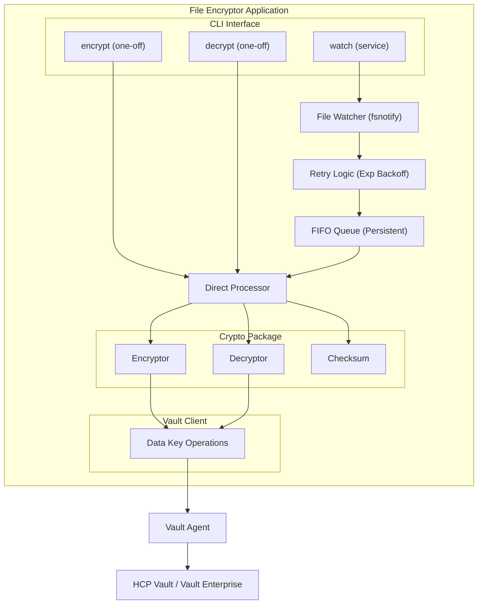
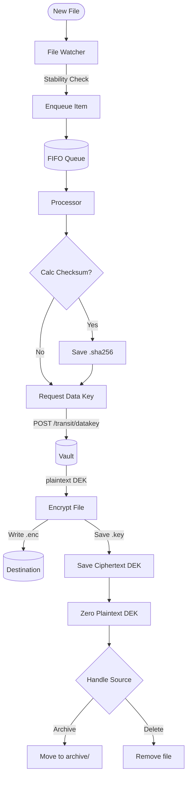
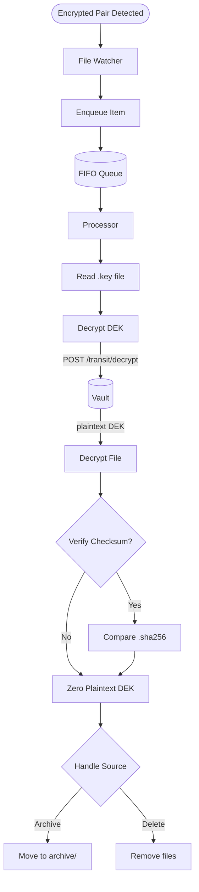
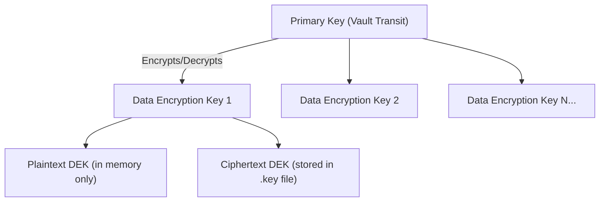
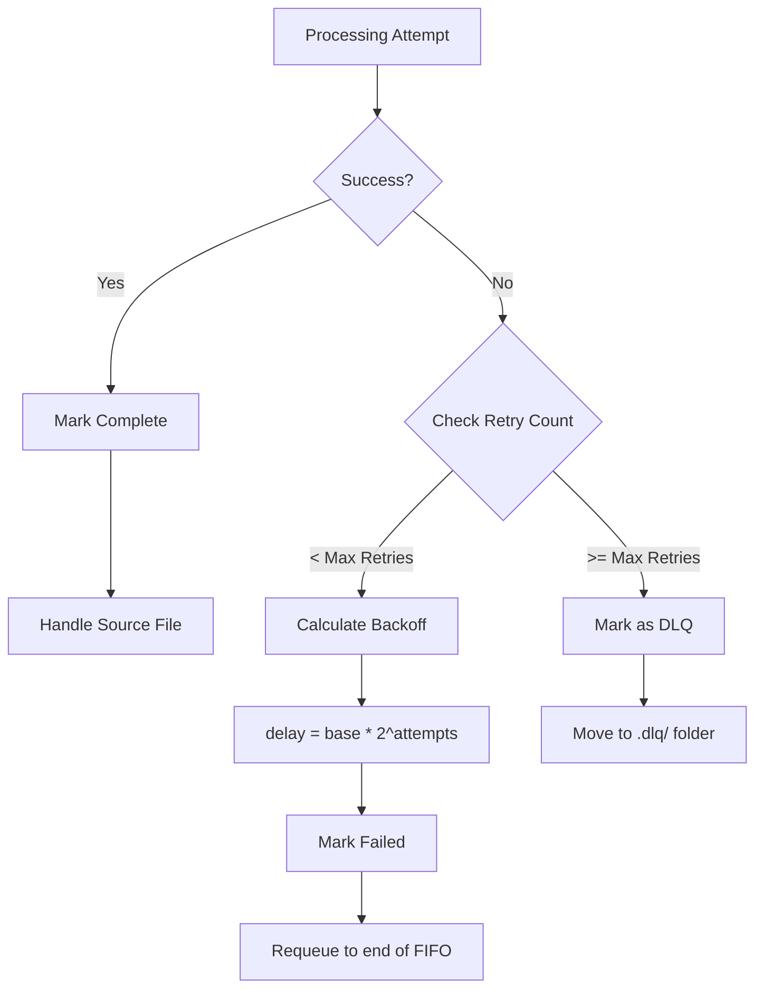
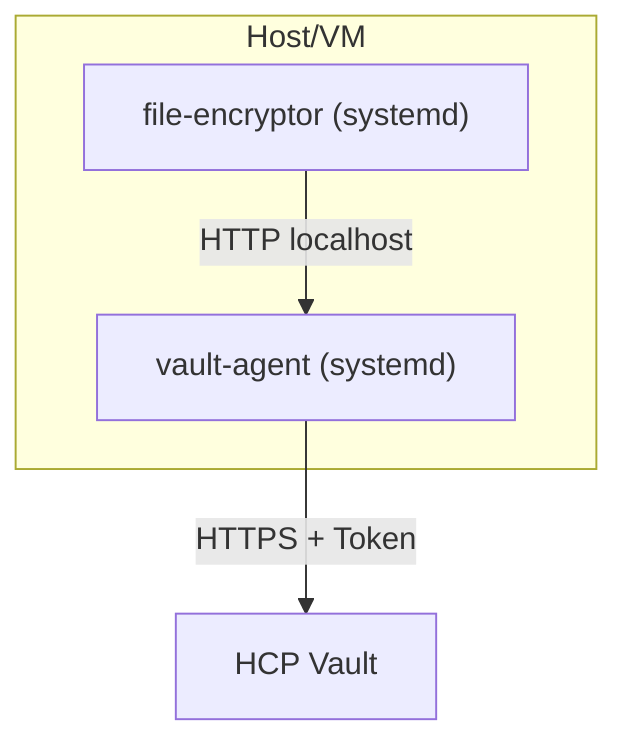
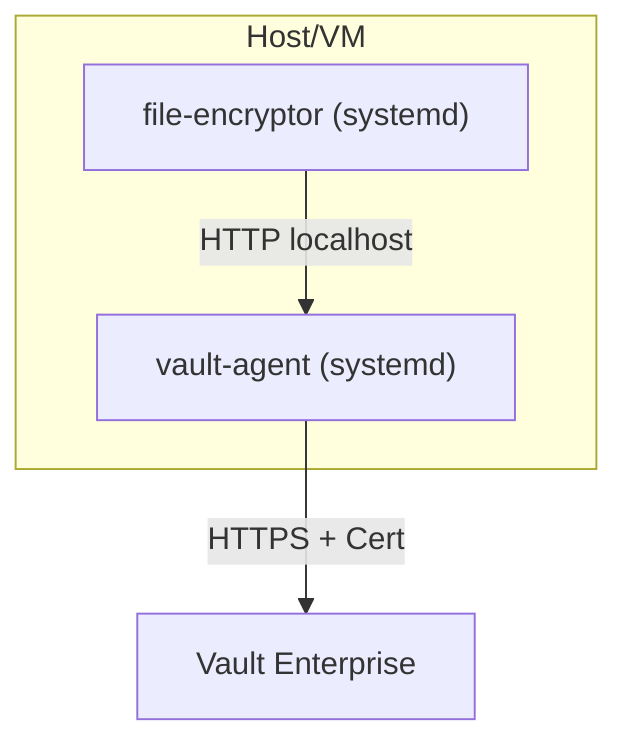

# Architecture

This document describes the architecture of the Vault File Encryption tool, including its core components, data flows, and security model.

## Overview

The application provides secure file encryption using HashiCorp Vault's Transit secrets engine. It implements **envelope encryption**, where a unique Data Encryption Key (DEK) is generated for each file and encrypted by Vault's primary key.

### Operation Modes

| Mode | Command | Description |
|------|---------|-------------|
| **Service Mode** | `watch` | Continuously monitors directories for new files |
| **CLI Mode** | `encrypt` / `decrypt` | One-off encryption or decryption of individual files |

### High-Level Architecture



---

## Data Flow

### Encryption Flow



### Decryption Flow



---

## Security Architecture

### Envelope Encryption

The application uses envelope encryption, a best practice for securing data at scale:

1. **Primary Key** — Stored securely in Vault, never leaves the HSM/server
2. **Data Encryption Key (DEK)** — Generated per-file, used locally for encryption
3. **Ciphertext DEK** — The DEK encrypted by the primary key, safe to store



### Encrypted File Format

```
.enc File:
┌──────────────┬─────────┬──────────────┬──────────────┬─────┐
│ Magic Header │ Version │ Salt         │ Chunk1       │ ... │
│ (4 bytes)    │ (1 byte)│ (32 bytes)   │ (ciphertext) │     │
└──────────────┴─────────┴──────────────┴──────────────┴─────┘
     │              │           │              │
     │              │           │              └─ Encrypted with AES-256-GCM
     │              │           └──────────────── Argon2id/PBKDF2 salt
     │              └──────────────────────────── Format version (v1)
     └─────────────────────────────────────────── File signature

.key File:
vault:v{version}:{base64-encrypted-DEK}
```

### Security Features

| Feature | Description |
|---------|-------------|
| **AES-256-GCM** | Authenticated encryption with 256-bit keys |
| **Unique DEK per file** | Limits blast radius if a key is compromised |
| **Memory zeroing** | Plaintext keys are securely zeroed after use |
| **Integrity verification** | GCM authentication tags and optional SHA-256 checksums |
| **Vault Agent** | Local proxy for caching, authentication, and token renewal |

---

## Error Handling

### Retry Strategy

Failed operations are automatically retried with exponential backoff:



### Dead Letter Queue

Files that fail after all retries are moved to the `.dlq/` directory for manual investigation.

---

## Deployment

### HCP Vault



### Vault Enterprise



---

## Configuration

### Hot Reload

Configuration changes can be applied without restarting the service by sending a `SIGHUP` signal:

```bash
kill -HUP $(pidof file-encryptor)
```

The application will:
1. Load and validate the new configuration
2. Apply changes if valid (or keep the current config if invalid)
3. Update all affected components (Vault client, watcher paths, queue settings)

### Graceful Shutdown

On receiving `SIGTERM` or `SIGINT`, the application:

1. Stops accepting new files
2. Saves the current queue state to disk
3. Flushes logs
4. Exits cleanly

On restart, the queue state is restored and processing resumes.

---

## Performance

| Aspect | Implementation |
|--------|----------------|
| **Streaming** | Files processed in 1MB chunks to limit memory usage |
| **Caching** | Vault Agent caches responses to reduce latency |
| **Sequential Processing** | Single processor ensures predictable ordering |
| **Progress Reporting** | Updates logged every 20% for large files |
