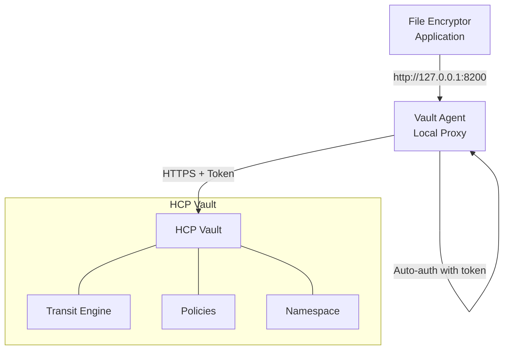

# Vault Setup Guide - HCP Vault

> **Note**: This guide is for **HCP Vault (cloud-hosted)** on **Unix, Linux, and macOS** platforms. For Windows, see [VAULT_SETUP_GUIDE_WINDOWS.md](VAULT_SETUP_GUIDE_WINDOWS.md). For Vault Enterprise setup, see [VAULT_ENTERPRISE_SETUP_GUIDE.md](VAULT_ENTERPRISE_SETUP_GUIDE.md).

This guide walks you through setting up HCP Vault for the file-encryptor application.

## Overview

The file-encryptor application with HCP Vault uses:
- **HCP Vault** (cloud-hosted) for key management
- **Vault Transit Engine** for envelope encryption
- **Token Authentication** via Vault Agent
- **Vault Agent** as a local proxy with caching

## Prerequisites

Before starting, ensure you have:

1. **HCP Vault Cluster**: Active and accessible
2. **Admin Token**: With permissions to create policies, mount engines, and configure auth
3. **Tools Installed**:
   - Terraform 1.5+
   - Vault CLI

> **Authentication**: HCP Vault uses **token-based authentication** via Vault Agent. Certificate authentication is used for Vault Enterprise (see the Enterprise guide).

## Quick Start

### 1. Configure Terraform Variables

```bash
cd scripts/vault-setup
cp terraform.tfvars.example terraform.tfvars
```

Edit `terraform.tfvars` with your HCP Vault details:

```hcl
vault_address     = "https://your-vault-cluster.hashicorp.cloud:8200"
vault_namespace   = "admin"
```

### 2. Deploy Vault Configuration

Set your Vault credentials:

```bash
export VAULT_TOKEN="your-admin-token"
export VAULT_ADDR="https://your-vault-cluster.hashicorp.cloud:8200"
export VAULT_NAMESPACE="admin"
```

Initialize and apply Terraform:

```bash
terraform init
terraform plan
terraform apply
```

### 3. Verify Configuration

```bash
# List transit keys
vault list transit/keys

# Read encryption key details
vault read transit/keys/file-encryption-key

# Test data key generation (using your admin token)
vault write -f transit/datakey/plaintext/file-encryption-key
```

### 4. Start Vault Agent

Update the Vault address and namespace in `configs/vault-agent/vault-agent-hcp-token.hcl`, then:

```bash
# Set your Vault token
export VAULT_TOKEN="your-hcp-admin-token"

# Start Vault Agent
vault agent -config=configs/vault-agent/vault-agent-hcp-token.hcl
```

Leave this running in a separate terminal. The file-encryptor application will connect to the agent at `http://127.0.0.1:8200`.

> **Note**: For production, use proper token management and consider using HCP Vault's managed authentication methods.

## What Gets Created

### Transit Engine
- **Mount Path**: `transit/`
- **Key Name**: `file-encryption-key`
- **Key Type**: AES-256-GCM
- **Configuration**: Non-exportable, deletion protection enabled

### Vault Policy
- **Name**: `file-encryptor-policy`
- **Permissions**:
  - [ALLOW] Generate plaintext data keys
  - [ALLOW] Decrypt data keys
  - [ALLOW] Read key metadata
  - [DENY] Direct encrypt/decrypt (enforces envelope encryption)

## Architecture



## Security Model

### Envelope Encryption Flow

1. Application requests plaintext data key from Vault
2. Vault generates random DEK and returns both plaintext and encrypted versions
3. Application encrypts file locally with plaintext DEK (AES-256-GCM)
4. Application saves encrypted DEK to `.key` file
5. Application zeros plaintext DEK from memory
6. Only encrypted DEK and ciphertext are stored

### Why Vault Agent?

- **Auto-authentication**: Automatically renews Vault tokens
- **Caching**: Reduces latency and Vault load
- **Simplified config**: Application doesn't need cert management
- **Token management**: Handles token lifecycle

## Production Considerations

### 1. Token Management

**Development** (current setup):
- Admin token with broad permissions
- Token stored in environment variable
- Suitable for testing only

**Production**:
- Use HCP Vault's managed authentication
- Implement token rotation
- Follow principle of least privilege
- Use short-lived tokens
- Consider HCP Vault's identity-based authentication

### 2. Key Rotation

Enable automatic key rotation:

```hcl
resource "vault_transit_secret_backend_key" "file_encryption" {
  # ... existing config ...
  auto_rotate_period = 2592000  # 30 days in seconds
}
```

Note: Old versions remain available for decryption.

### 3. High Availability

HCP Vault provides:
- Built-in HA cluster
- Automatic failover
- Regional redundancy

Ensure Vault Agent is configured to handle reconnection.

### 4. Monitoring & Auditing

Enable audit logging in Vault:

```bash
vault audit enable file file_path=/var/log/vault/audit.log
```

Monitor:
- Key usage patterns
- Authentication failures
- Rate limiting
- Token renewals

### 5. Network Security

Production checklist:
- [ ] Secure token storage and rotation
- [ ] Firewall rules restricting Vault access
- [ ] CIDR restrictions in token policies
- [ ] Network segmentation
- [ ] Use HCP Vault's private endpoints if available

## Troubleshooting

### Token Authentication Fails

**Symptom**: `permission denied` when using token

**Solutions**:
1. Verify token is valid: `vault token lookup`
2. Check token has required policies
3. Ensure token is not expired
4. Verify namespace is correct (HCP uses `admin` by default)
5. Check VAULT_TOKEN environment variable is set

### Transit Key Not Found

**Symptom**: `transit key not found`

**Solutions**:
1. Check namespace: `vault namespace list`
2. List keys: `vault list transit/keys`
3. Verify Terraform applied successfully
4. Check mount path matches config

### Vault Agent Connection Issues

**Symptom**: Agent can't connect to HCP Vault

**Solutions**:
1. Verify `VAULT_ADDR` is correct
2. Check network connectivity: `curl -k $VAULT_ADDR/v1/sys/health`
3. Verify namespace: HCP uses `admin` by default
4. Check firewall rules

### Permission Denied on Operations

**Symptom**: Application can authenticate but operations fail

**Solutions**:
1. Check assigned policies: `vault token lookup`
2. Verify policy content: `vault policy read file-encryptor-policy`
3. Test with Vault CLI using same credentials
4. Check path in policy matches mount path

## Testing the Setup

### Manual Test: Encrypt/Decrypt Flow

```bash
# 1. Set environment variables
export VAULT_ADDR="https://your-vault-cluster.hashicorp.cloud:8200"
export VAULT_TOKEN="your-admin-token"
export VAULT_NAMESPACE="admin"

# 2. Generate data key
vault write -f transit/datakey/plaintext/file-encryption-key

# Save the output (you'll get plaintext and ciphertext)

# 3. Decrypt the encrypted DEK
vault write transit/decrypt/file-encryption-key \
  ciphertext="vault:v1:encrypted_dek_from_above"
```

### Automated Testing

The application includes integration tests that verify:
- [x] Vault connectivity via Agent
- [x] Data key generation
- [x] Data key decryption
- [x] Policy enforcement
- [x] Error handling

Run tests:
```bash
make test-integration
```

## Cleanup

To remove all Vault configuration:

```bash
cd scripts/vault-setup
terraform destroy
```

## Next Steps

After completing Vault setup:

1. [DONE] Verify Terraform outputs
2. [DONE] Test certificate authentication
3. [DONE] Confirm Vault Agent is running
4. [DONE] Ready to use the application

Proceed to [CLI Usage](CLI_MODE.md) or [Architecture](../ARCHITECTURE.md) for implementation details.

## Related Guides

- **Vault Enterprise Setup**: See [VAULT_ENTERPRISE_SETUP_GUIDE.md](VAULT_ENTERPRISE_SETUP_GUIDE.md)
- **CLI Usage**: See [CLI_MODE.md](CLI_MODE.md)
- **Windows Users**: See [VAULT_SETUP_GUIDE_WINDOWS.md](VAULT_SETUP_GUIDE_WINDOWS.md)

## Additional Resources

- [HCP Vault Documentation](https://developer.hashicorp.com/vault/docs/platform/hcp)
- [Vault Transit Engine](https://developer.hashicorp.com/vault/docs/secrets/transit)
- [Vault Agent](https://developer.hashicorp.com/vault/docs/agent)
- [Envelope Encryption](https://developer.hashicorp.com/vault/tutorials/encryption-as-a-service/eaas-transit)
